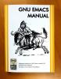

- 👋 Hi, I’m @agrawal-rahul
- 👀 I’m interested in ...
- 🌱 I’m currently learning ...
- 💞️ I’m looking to collaborate on ...
- 📫 How to reach me ...

<!---
agrawal-rahul/agrawal-rahul is a ✨ special ✨ repository because its `README.md` (this file) appears on your GitHub profile.
You can click the Preview link to take a look at your changes.
--->

- Reading List
  - Reading
    - Emacs Manual
    - Org Mode Manual
    - Pro Git - Scott Chacon and Ben Straub
  - To Be Read
  - Read

| --- | --- | --- |
|  |  |  |
| GNU Emacs Manual | Org Mode Manual | Pro Git - Scott Chacon and Ben Straub |
